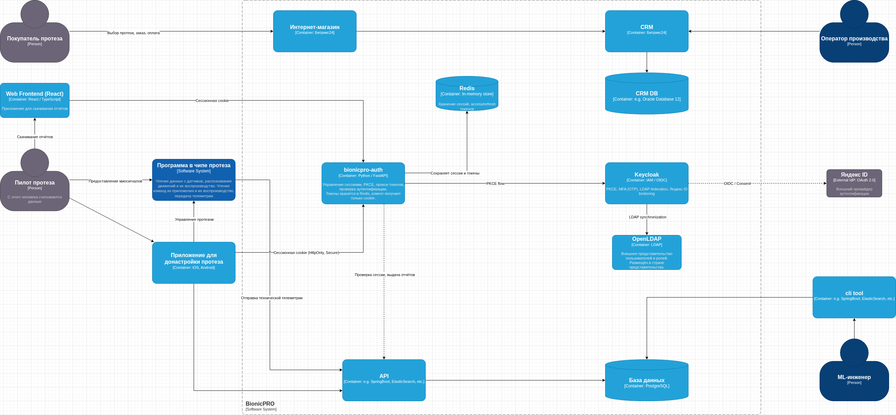
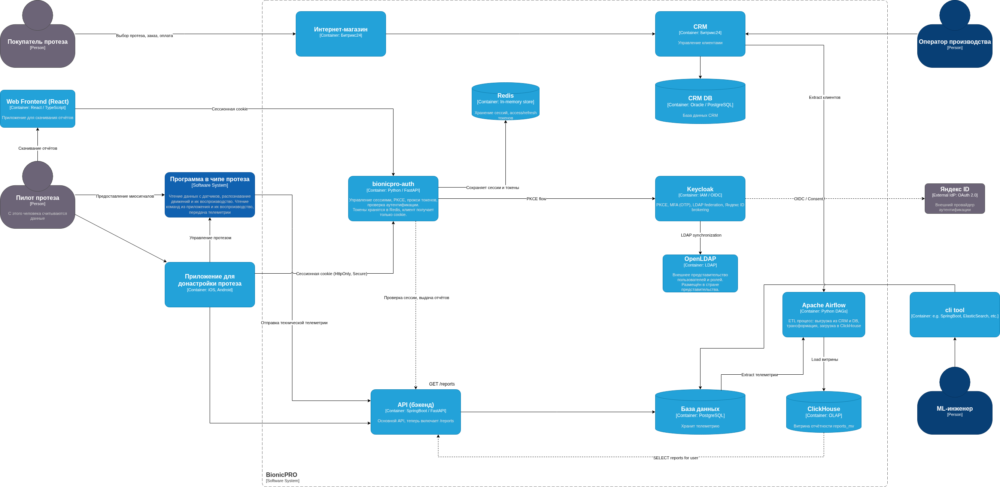

# Спринт 9: BionicPRO

## Задание 1.1
Для устранения уязвимостей и повышения безопасности предлагается следующая архитектура:
1. Внедрение промежуточного бэкенд-сервиса `bionicpro-auth`
- Выступает в роли доверенного посредника между фронтендом и `Keycloak`.
- Реализует PKCE-поток (замена Code Grant) и хранит `access_token` и `refresh_token` на серверной стороне.
- Фронтенд получает только HTTP-only, Secure-сессионную cookie, которая привязана к сессии на сервере.
- Сервис автоматически обновляет `access_token` через `refresh_token`, поддерживает ротацию сессий (против session fixation).
2. Keycloak
- Настроен на использование PKCE для публичного клиента (`reports-frontend`).
- Подключён к LDAP (OpenLDAP) для получения пользователей из внешнего представительства.
- Включена MFA (OTP) для всех пользователей.
- Добавлен Identity Provider «Яндекс ID» через Identity Brokering с запросом согласия (consent).
3. LDAP-сервер
- Развёрнут OpenLDAP с конфигурацией из `ldap/config.ldif`.
- Keycloak синхронизирует пользователей и роли (`user`, `prothetic_user`).
4. Яндекс ID
- Пользователи могут войти через Яндекс. После аутентификации Keycloak запрашивает разрешение на использование данных (консент) и сохраняет профиль.
5. База данных сессий (Redis)
- Используется для хранения сессий и токенов в распределённой среде (можно заменить на in-memory, но для production рекомендуется Redis).
### Диаграмма архитектуры (C4)

## Задание 1.5: Экспорт realm
- `docker exec architecture-bionicpro-keycloak-1 /opt/keycloak/bin/kc.sh export --realm reports-realm --file /tmp/keycloak-results-export.json --users realm_file`
- `docker cp architecture-bionicpro-keycloak-1:/tmp/keycloak-results-export.json ./keycloak/keycloak-results-export.json`

## Задание 2.1: Архитектура решения для подготовки и получения отчётов

### Описание компонентов
- **CRM (Битрикс24)** – источник данных о клиентах.
- **База данных (PostgreSQL)** – хранилище телеметрии с протезов.
- **Apache Airflow** – ETL-оркестратор, запускается по расписанию (`0 2 * * *`), извлекает данные из CRM и БД, трансформирует и загружает в ClickHouse.
- **ClickHouse** – OLAP-база данных, содержит витрину `reports_mv` с агрегированными отчётами по пользователям.
- **API (бэкенд)** – предоставляет эндпоинт `/reports`, который по сессионной cookie определяет пользователя и возвращает только его собственные данные из ClickHouse.
- **Web Frontend (React)** – кнопка «Download Report» вызывает `/reports` и отображает полученные данные.
### Примечание
ETL-процесс запускается ежедневно в 2:00, поэтому отчёт содержит только данные, уже обработанные Airflow.

## Задание 3: Снижение нагрузки на базу данных
Добавлены:
- Minio (S3-совместимое хранилище) для сохранения сгенерированных отчётов.
- Nginx как CDN с кешированием статических файлов отчётов.
- В API-сервисе реализована логика: при запросе отчёта сначала проверяется наличие в S3, если есть – отдаётся ссылка на CDN, если нет – генерируется, сохраняется в S3 и возвращается ссылка.
- Структура хранения: `reports/{user_id}/{period}.json`.
- Кеш в Nginx инвалидируется по времени (60 минут) или при обновлении отчёта (можно расширить).